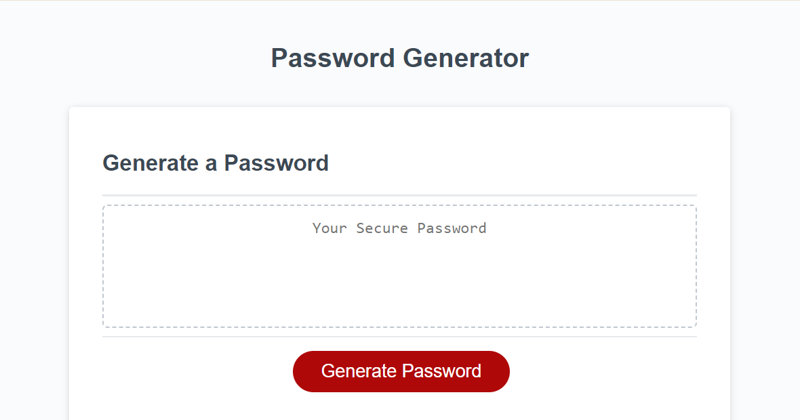
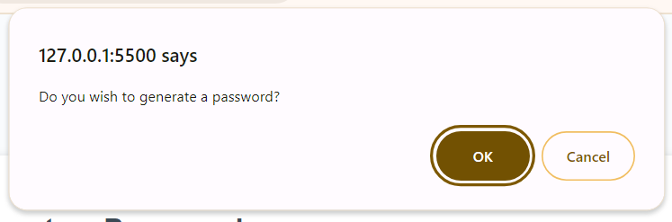
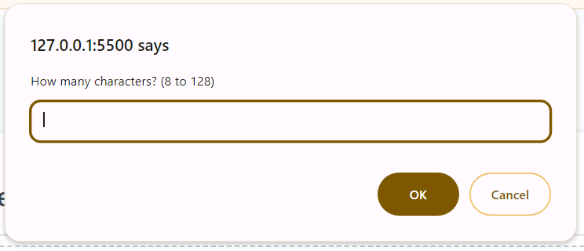
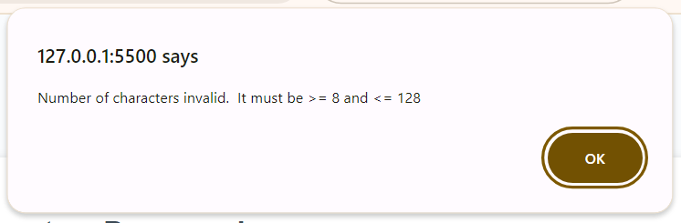
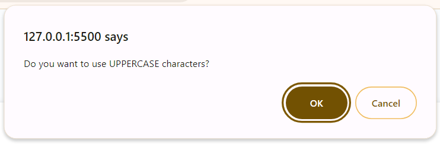
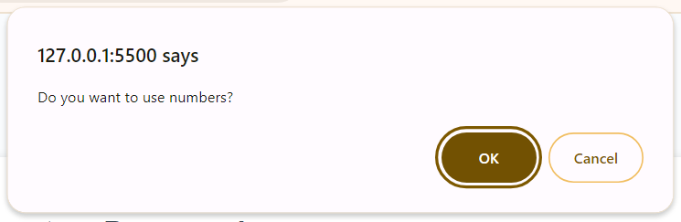
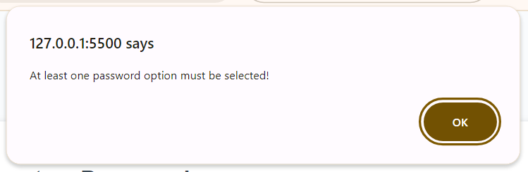
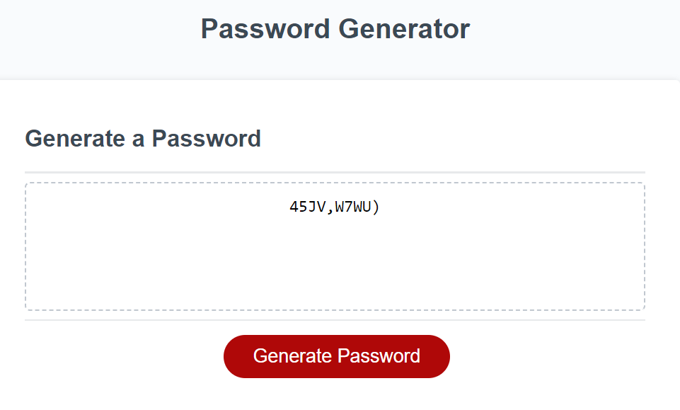

# Generate Password

## Description

This page runs a JavaScript that provides the user with the ability to generate a password. The generated password can then be cut from the page and pasted as required.

## Table of Contents

* [Links](#links)
* [Installation](#installation)
* [Usage](#usage)
* [Screenshots](#screenshots)
* [License](#license)
* [Features](#features)

## Links

- [Repo](https://github.com/cadbuckle/genpassword)
- [Live](https://cadbuckle.github.io/genpassword/)

## Installation

N/A

## Usage 

After the page is displayed, clicking the "Generate Password" button will start the process.
A confirmation prompt will initially be given to ensure the user wants to generate a password.
If the user has confirmed they want a password, further individual prompts will be given to the user for:
- Enter the maximum number of characters for the password. This must be from 8 to 128 characters. 
The following 4 prompts will then be given to the user. At least one of them must be selected.
- To confirm if the user wants to use lowercase characters.
- To confirm if the user wants to use uppercase characters.
- To confirm if the user wants to use numbers.
- To confirm if the user wants to use special characters. 
The system will then generate the password and then display it to the user. 

## Screenshots
### Initial Screen
</img>
### Confirm Password Required
</img>
### How Many Characters?
</img>
### Invalid Number of Characters
</img>
### Lowercase Required?
</img>
### Uppercase Required?
</img>
### Numbers Required?
</img>
### Special Characters Required?
</img>
### Must Select An Option Error
</img>
### Generated Password
</img>

## License

MIT License as per repository.

## Features

JavaScript, notably:
- User entry/selection validation.
- Arrays: reading and concatenation of.
- Math: for randomisation of character selection.

© 2023 edX Boot Camps LLC. Confidential and Proprietary. All Rights Reserved.
